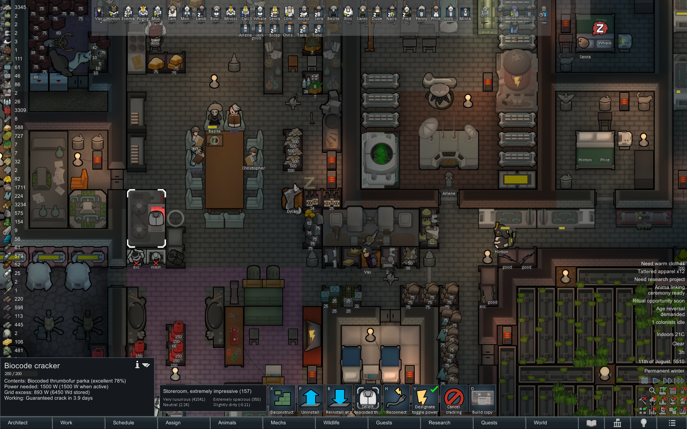

# BiocodeCracker
A Rimworld Mod that adds a cracker machine for biocoded items
![A shopped screenshot showing the biocdoe cracker in a fake base, where it is not that obvious that the base is fake, cracking the biocode on a bioded doomsday launcher. The inspect sring says "Working: Guaranteed crack in 3.9 days". Power usage is 1500 W because the machine is active. There are gene banks around the machine, although that doesn't make sense, because you need the Xenogermakeamagizmo to be able to use those at all. There are also wastepack atommizers beausce they look nice. Hidden under the inspector textbox is a fabrication bench with ample amounts of gold and plasteel and advanced components. their is a devilstrand armchair as the work seat on that bench. But that is not visible beacuse the inpector box is photshopped over it.](About/Preview.png)

